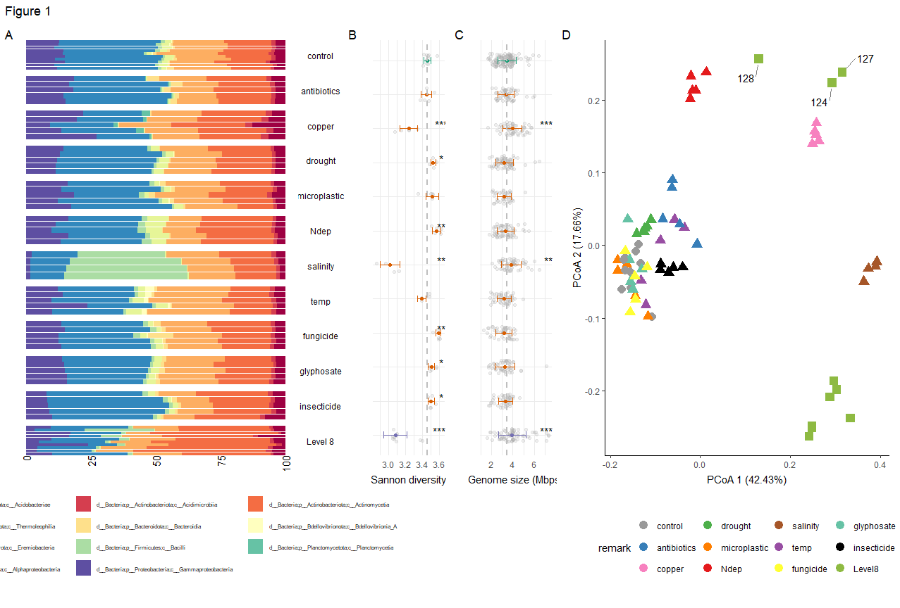

# Multiple_GC_soil_experiment
Scripts used during the analysis of the metagenomes of 70 soil samples exposed to 10 individual global change factors, and to the random combinations of 8 concurrent factors.

This repository includes: 
- A script with all the statistical analysis (`statistics.r`)
- Scripts for generating the main figures (`Figure 1-6.r`)
